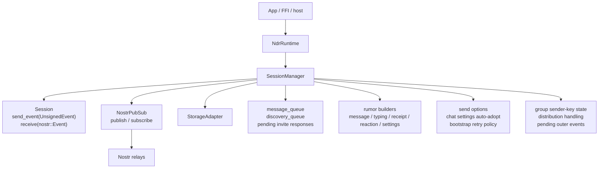
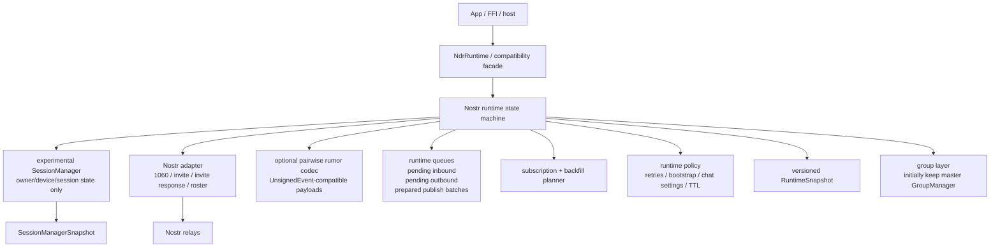
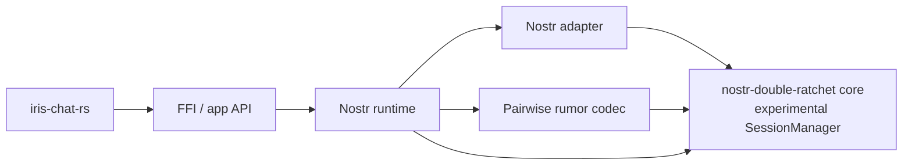
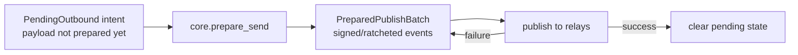
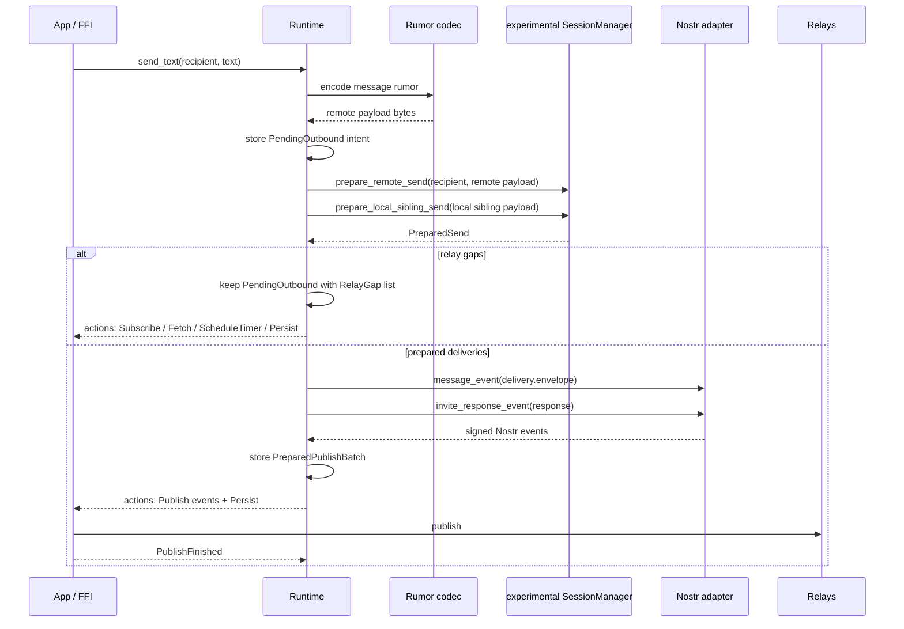
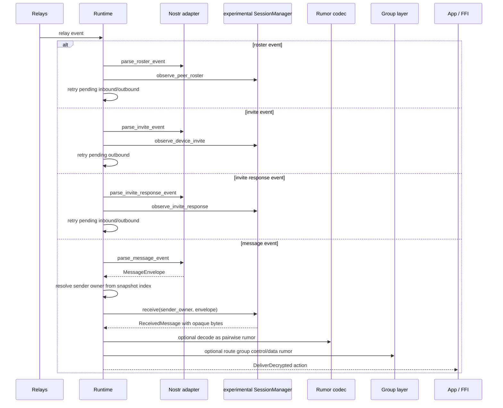
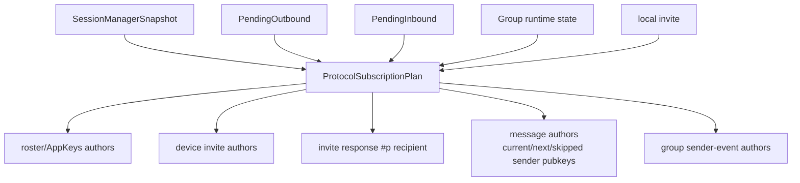
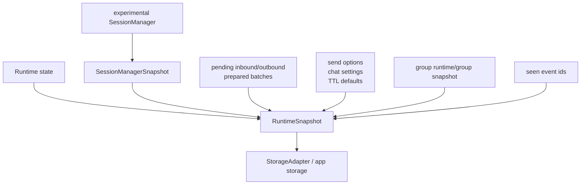

# Experimental-Inspired Runtime Architecture

This document describes the proposed architecture for replacing the current
`master` pairwise session core with the simpler experimental `SessionManager`
model while preserving the public runtime, FFI, and application behavior.

The goal is not to move the experimental branch into `master` wholesale. The
goal is to keep the experimental `SessionManager` as a small synchronous
protocol state machine, and move queues, subscriptions, retries, wire encoding,
and app-level rumor semantics into layers above it.

## Current Boundary In Master

Today, `SessionManager` owns protocol state and a large amount of runtime and
application policy.



The current `SessionManager` includes these responsibilities:

| Responsibility | Current location |
| --- | --- |
| Nostr pubsub action output | `src/session_manager.rs::SessionManagerEvent` |
| `Arc` / `Mutex` / actor based mutable state | `src/session_manager.rs::SessionManager` |
| Internal discovery and per-device queues | `src/session_manager/sending.rs`, `src/session_manager/queues.rs` |
| Startup side effects | `src/session_manager/api.rs::init` |
| Event dispatch and wire parsing | `src/session_manager/event_processing.rs` |
| AppKeys roster handling | `src/session_manager/records.rs`, `src/session_manager/devices.rs` |
| Invite acceptance and link bootstrap | `src/session_manager/accept_invite.rs`, `src/session_manager/invite_bootstrap.rs` |
| Chat settings and disappearing-message defaults | `src/session_manager/settings_storage.rs`, `src/session_manager/message_policy.rs` |
| Group sender-key control side effects | `src/session_manager/group_sender_keys.rs` |
| Session selection and promotion | `src/session_manager/session_selection.rs` |

Recent `master` commits improved the file layout, but the architectural boundary
is still the same: `SessionManager` is both the pairwise protocol core and the
runtime orchestrator.

## Target Boundary

The target architecture makes `SessionManager` a pure protocol component. The
runtime becomes the owner of relay interaction, retry policy, persistence, and
plaintext semantics.



The dependency direction should be strict:



Core must not depend on runtime, relays, Nostr event filters, app payload
schemas, queues, timers, or FFI.

## Core Component

The core component is the experimental `SessionManager` shape. It should be
imported or ported as-is before adding runtime behavior around it.

Key structs and methods:

| Type / method | Responsibility |
| --- | --- |
| `SessionManager` | Owns local owner/device identity and per-owner/device session state. |
| `SessionManagerSnapshot` | Complete serializable core state. |
| `PreparedSend` | Result of preparing a send: deliveries, invite responses, and missing relay prerequisites. |
| `Delivery` | A prepared encrypted message envelope for one target device. |
| `RelayGap` | Transport-neutral statement of what protocol data is missing. |
| `MessageEnvelope` | Wire-neutral encrypted pairwise message envelope. |
| `InviteResponseEnvelope` | Wire-neutral invite response envelope. |
| `ReceivedMessage` | Authenticated owner/device plus opaque decrypted payload. |
| `ensure_local_invite` | Ensures the local public invite exists. No publishing. |
| `observe_peer_roster` | Applies a signed owner roster decoded by the adapter/runtime. |
| `observe_device_invite` | Records a public device invite decoded by the adapter/runtime. |
| `observe_invite_response` | Processes a local invite response. |
| `prepare_send` | Prepares remote plus local-sibling deliveries. |
| `prepare_remote_send` | Prepares only remote owner deliveries. |
| `prepare_local_sibling_send` | Prepares only local sibling sender-copy deliveries. |
| `receive` | Decrypts a `MessageEnvelope` for a known sender owner. |

Important invariant:

`SessionManager` must never parse decrypted plaintext. It returns `Vec<u8>` and
authenticated transport identity. Plaintext interpretation happens above core.

## Runtime Component

The runtime replaces the old `SessionManager` runtime responsibilities. It
should be implemented as a synchronous state machine that accepts inputs and
emits actions. Async networking can execute those actions outside the state
machine and feed results back in.

Proposed shape:

```rust
pub enum RuntimeInput {
    Startup,
    SendRumor {
        recipient_owner: OwnerPubkey,
        remote_payload: Vec<u8>,
        local_sibling_payload: Option<Vec<u8>>,
        correlation_id: String,
    },
    RelayEvent(nostr::Event),
    PublishFinished {
        correlation_id: String,
        success: bool,
    },
    TimerFired(TimerId),
}

pub enum RuntimeAction {
    Publish(nostr::Event),
    Subscribe {
        subid: String,
        filter: nostr::Filter,
    },
    Unsubscribe(String),
    Fetch(Vec<nostr::Filter>),
    DeliverDecrypted {
        sender_owner: OwnerPubkey,
        sender_device: Option<DevicePubkey>,
        payload: Vec<u8>,
        outer_event_id: Option<String>,
    },
    ScheduleTimer {
        id: TimerId,
        after_ms: u64,
    },
    Persist(RuntimeSnapshot),
}
```

The runtime owns:

| Runtime state | Purpose |
| --- | --- |
| `SessionManagerSnapshot` | Embedded core snapshot. |
| `PendingOutbound` | User/app intent waiting for roster, invite, or publish retry. |
| `PendingInbound` | Raw envelopes or decrypted payloads that could not yet be applied. |
| `PreparedPublishBatch` | Already-ratcheted signed events waiting for publish retry. |
| `ProtocolSubscriptionPlan` | Desired relay filters for rosters, invites, invite responses, and message authors. |
| `RuntimePolicySnapshot` | Send options, chat settings, TTL defaults, bootstrap retry policy, and flags. |
| `seen_event_ids` | Dedupe cache for relay replays. |
| `group_runtime_state` | Sender-key outer subscriptions and pending group control state. |

The important runtime distinction is:



Once a send has become a `PreparedPublishBatch`, retry must reuse the same
events. It must not call `prepare_send` again, because `prepare_send` advances
ratchet state.

## Adapter Component

The adapter owns Nostr wire artifacts.

| Adapter function | Runtime use |
| --- | --- |
| `message_event(MessageEnvelope) -> nostr::Event` | Convert core delivery to outer `1060`. |
| `parse_message_event(nostr::Event) -> MessageEnvelope` | Decode outer `1060` before core receive. |
| `invite_unsigned_event(Invite) -> UnsignedEvent` | Publish local device invite. |
| `parse_invite_event(nostr::Event) -> Invite` | Decode discovered public invites. |
| `invite_response_event(InviteResponseEnvelope) -> nostr::Event` | Publish invite response. |
| `parse_invite_response_event(nostr::Event) -> InviteResponseEnvelope` | Decode invite responses for the local invite. |
| `roster_unsigned_event(DeviceRoster) -> UnsignedEvent` | Publish local roster/AppKeys replacement. |
| `parse_roster_event(nostr::Event) -> DeviceRoster` | Decode peer rosters. |

Compatibility decisions still needed in this layer:

| Topic | Decision |
| --- | --- |
| Legacy invite URL fields | Preserve or translate `device_id`, `purpose`, and `owner`. |
| Legacy invite `d` tag | Decide whether to accept both device-id and device-pubkey forms. |
| AppKeys labels | Keep labels as runtime/app metadata, not core roster state. |
| Roster/AppKeys exact wire compatibility | Decide whether the experimental roster event is enough or whether a legacy AppKeys codec is needed. |

## Pairwise Rumor Codec

The pairwise rumor codec is optional. Users should be able to provide arbitrary
payload bytes to the runtime/core. The codec exists for applications that want
to interoperate with the Iris/master rumor format.

The codec should encode and decode serialized `UnsignedEvent` JSON for:

| Rumor | Legacy-compatible fields |
| --- | --- |
| Message | `kind = CHAT_MESSAGE_KIND`, body in `content`. |
| Typing | `kind = TYPING_KIND`, `content = "typing"`. |
| Receipt | `kind = RECEIPT_KIND`, receipt type in `content`, target ids in `e` tags. |
| Reaction | `kind = REACTION_KIND`, emoji in `content`, target id in `e` tag. |
| Chat settings | `kind = CHAT_SETTINGS_KIND`, JSON settings payload in `content`. |
| Disappearing message expiration | `expiration` tag. |
| Version marker | explicit protocol/version tag. |

The codec may preserve `pubkey` for rumor compatibility, but transport must not
trust it. Runtime delivery identity comes from `ReceivedMessage`, not from
plaintext.

If the new format omits the legacy recipient `p` tag, that is an intentional
compatibility break. Sender-copy routing and chat-settings peer resolution must
come from runtime context, not plaintext tags.

## Send Flow



## Receive Flow



## Subscription And Backfill Planning

Subscriptions should be derived from runtime state plus core snapshots. The
planner should not live in core.



Message author computation should use an index derived from session state:

| Source | Authors |
| --- | --- |
| `their_current_nostr_public_key` | Current expected sender key. |
| `their_next_nostr_public_key` | Next expected sender key. |
| `skipped_keys` | Out-of-order sender keys. |
| group sender-event state | One-to-many group outer authors. |

The runtime should maintain a fast lookup from message author pubkey to candidate
owner/device/session. This avoids repeatedly cloning the full `SessionManager`
to probe every owner during inbound processing.

## Persistence

Runtime persistence should be versioned and atomic from the runtime's point of
view.



The runtime should persist after:

| Event | Reason |
| --- | --- |
| Core state changes | Ratchet/session state changed. |
| Prepared publish batch created | Retrying must reuse the same signed events. |
| Publish finishes | Pending state changes. |
| Roster/invite/response observed | Discovery state changed. |
| Pending inbound/outbound changes | Restart must continue work. |
| Runtime policy changes | TTL/settings behavior changed. |

## Group Strategy

For the first migration stage, keep the current `master` `GroupManager` and
wire its pairwise send closures through the new runtime.

This avoids blocking the pairwise core replacement on a full sender-key rewrite.
The group layer should eventually own:

| Group responsibility | New owner |
| --- | --- |
| Sender-key distribution decode/encode | Group layer or group codec. |
| Sender-key state persistence | Group snapshot/runtime state. |
| Pending outer group messages | Group runtime. |
| Group outer subscriptions | Runtime subscription planner. |
| Pairwise control-plane sends | Runtime pairwise send API. |

The pairwise core should not know about group sender-key rumors or group outer
events.

## Migration Phases

1. Add the new runtime state and action model without changing public APIs.
2. Port or import the experimental `SessionManager` as an internal core module.
3. Implement snapshot conversion from current stored user records to the new
   `SessionManagerSnapshot`.
4. Implement the Nostr adapter compatibility layer.
5. Implement the pairwise rumor codec.
6. Rewrite send helpers to use codec + runtime pending queue + core
   `prepare_send`.
7. Rewrite receive dispatch to use adapter + core `observe_*` / `receive`.
8. Move subscriptions and backfill computation fully into runtime.
9. Move chat settings and disappearing-message policy into runtime state.
10. Bridge current `GroupManager` through runtime pairwise sends.
11. Delete old queue/pubsub/policy fields from `SessionManager`.
12. Tighten tests and remove old compatibility shims once public APIs pass.

## Critical Tests

The migration should be driven by characterization tests before old behavior is
removed.

| Test | Why it matters |
| --- | --- |
| Missing roster send queues, fetches roster, then sends | Replaces discovery queue. |
| Missing device invite queues, fetches invite, then sends | Replaces device queue wait. |
| Publish failure retries same prepared events | Prevents accidental ratchet advancement. |
| Restart with prepared publish batch succeeds | Validates persistence boundary. |
| Inbound envelope waits until sender owner can be resolved | Replaces event-driven session probing. |
| Linked-device bootstrap before AppKeys works intentionally | Captures link invite behavior. |
| Self-sync fanout works without plaintext `p` routing | Removes rumor dependency. |
| Chat settings apply outside core | Ensures plaintext semantics stay above core. |
| Sender-key distribution reaches group layer | Keeps group semantics out of pairwise core. |
| Revoked/stale devices are not targeted | Preserves roster authorization behavior. |

## Non-Goals

- Do not make experimental `SessionManager` own storage, pubsub, timers, or
  Nostr filters.
- Do not make core parse `UnsignedEvent` plaintext.
- Do not keep the old and new session managers as parallel sources of truth.
- Do not solve the full sender-key/group rewrite before the pairwise runtime
  boundary is stable.
- Do not require all users to adopt the Iris rumor codec. The runtime should
  accept opaque payload bytes.

## Main Risk

The dangerous part is not encryption. It is preserving runtime behavior while
moving ownership.

The main invariant is:

| State kind | Single owner |
| --- | --- |
| Pairwise protocol/session state | experimental `SessionManager` |
| Relay subscriptions, fetches, retries, queues | runtime |
| Nostr wire encoding | adapter |
| Pairwise plaintext semantics | optional rumor codec / app |
| Group plaintext and sender-key semantics | group layer |
| Product UI state | app |

Any implementation that gives the same state to two layers will recreate the
current problems in a different shape.
